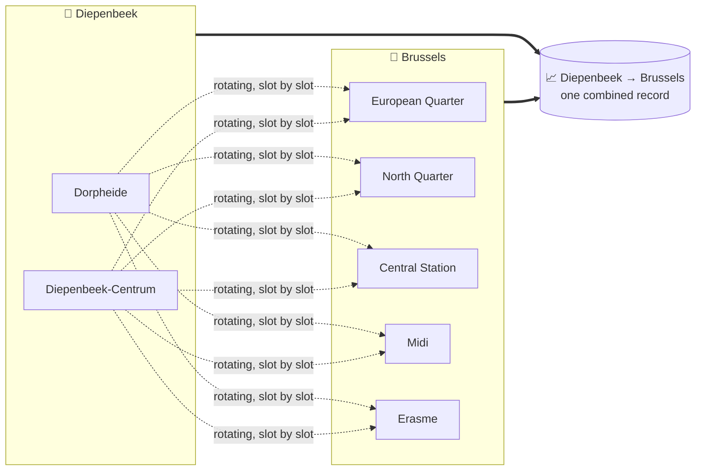
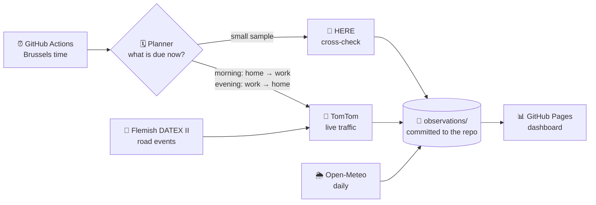

<div align="center">

# 🚗 TravelSmart Belgium

### *When is the best moment to leave?*
**Real commutes across Belgium, measured live every working day, joined with weather, school holidays, daylight and roadworks.**

[](https://github.com/kvandebeek/travelsmart/actions/workflows/commutes.yml)


### [📊 Open the live dashboard →](https://kvandebeek.github.io/travelsmart/commutes.html)

</div>

---

## 💡 The idea

Every commuter knows the feeling: leave ten minutes later and you lose half an hour on the ring road. Maps can tell you how long a trip takes **right now**, but they can't tell you **when you should have left**.

TravelSmart builds that answer from the ground up. Every working morning and afternoon it measures real Belgian commutes with live traffic. Over weeks and months, that turns into a picture of each commute:

> 🕖 *"From Diepenbeek to Brussels, leaving at 06:55 instead of 07:25 is usually faster, and the gap widens on rainy school days."*

No guesswork, no averages scraped from someone else's app. Every number comes from a measurement with a timestamp.

## 🏘️ A commute is a town, not a street

A single street corner would only tell you about that one street. So each commute record, such as **Diepenbeek → Brussels**, is fed by several real places:



- **Start places** are residential neighbourhoods, chosen from [Statbel](https://statbel.fgov.be) population data: the most populated parts of each town, spread over its former villages. Larger towns get more of them; Brussels gets one per major municipality.
- **Destinations** are real employment areas: business parks, office districts, ports and big hospitals. Larger cities have several.
- **Every combination feeds the same town record.** Each measurement rotates to a different start place and destination, so the result reflects the whole town, not one lucky street. On the dashboard you can still drill down to a single neighbourhood or employment area.

**33 Belgian towns · 90 neighbourhoods · 56 employment areas · 297 commutes**, each at least 12 km by road. Very short trips are left out.

## ✨ What every measurement carries

| | |
|---|---|
| 🚦 **Live traffic** | Travel time, distance and traffic delay, requested at the moment of departure |
| 🌦️ **Weather** | Rain, temperature and wind at the start when leaving and at the destination on arrival |
| 🏫 **School calendar** | Flemish *and* French Community school days. Brussels traffic feels both |
| 🌗 **Daylight** | Daylight, twilight or dark at departure and arrival |
| 🚧 **Road events** | Live Flemish jams, accidents, roadworks and lane closures along the actual route |
| 🕒 **Honest timestamps** | Stamped with the real request time. A late run is stored as late; a missed slot stays missing. Nothing is backfilled |

## 🧭 How it runs



1. **Morning and evening peaks.** Departures every 15–20 minutes from 05:00 to 09:00, and every 30 minutes from 14:00 to 18:00, on Belgian working days. Public holidays are skipped automatically.
2. **Priority commutes in every slot.** Twenty key commutes, such as Diepenbeek, Hasselt, Ghent, Antwerp and Leuven to Brussels, are measured at every departure time on every working day.
3. **Everything else in rotation.** All other commutes are spread over the month so each one builds up a full departure-time profile.
4. **Weather follows.** A daily job adds weather from the Open-Meteo archive once the hourly records are available, a few days after the trip.
5. **Always within free allowances.** Hard caps stop collection well before any provider's free tier runs out.

## 📊 The dashboard

Pick a commute and see:

- ⏱️ **Travel time by departure slot**, every measurement as a dot with the median as a line
- 🌧️ **Rain vs. dry** compared fairly, within the same commute and departure time
- 🎛️ **Filters** for start place, employment area, school days, daylight, weekday and road events
- 🧾 **An audit trail** of recent measurements: which neighbourhood, when, and under what conditions

It's plain HTML, CSS and JavaScript on GitHub Pages: no build step and no framework, and it follows your light or dark preference.

## 🚀 Run it yourself

Requires Python 3.10 or newer.

```bash
python -m venv .venv
.venv/bin/pip install -e ".[dev]"   # Windows: .venv\Scripts\pip install -e ".[dev]"
pytest

python scripts/plan_commutes.py --day 2026-10-12         # what would be measured that day
python scripts/run_commute_tick.py                       # dry run: what is due right now?
python scripts/export_commutes.py                        # build the dashboard data
python -m http.server --directory public 8080            # http://localhost:8080/commutes.html
```

**Collecting on your own fork:** add your TomTom and HERE keys as Actions secrets, using the names in `config/commute_schedule.yaml`. Then enable **Settings → Pages → Source: GitHub Actions** and check the caps in that file against your own plans.

**Changing the places:**

```bash
python scripts/select_home_places.py --statbel-dir <statbel>   # neighbourhoods from population data
python scripts/build_commute_catalogue.py                      # snap to roads, pair, measure road distance
```

<details>
<summary><b>🗂️ Project map</b></summary>

```
config/
  commute_catalogue.yaml   towns, employment areas, pairing rules
  commute_homes.yaml       neighbourhoods per town (generated from Statbel)
  commute_anchors.yaml     road-snapped points + road distance per route
  commute_routes.csv       every start place → employment area route
  commute_schedule.yaml    departure slots, caps, priority commutes
travelsmart/
  commute_planner.py       working days, holidays, rotating monthly plan
  commute_live.py          guarded live collection → JSONL
  commute_context.py       school calendars, daylight, road events
  commute_weather.py       Open-Meteo join
  commute_export.py        static JSON for the dashboard
scripts/                   catalogue builders, planner, collector, exports
observations/              measurements, committed by the workflow
public/                    dashboards
```
</details>

<details>
<summary><b>🗺️ Also included: an OSRM baseline and Flemish live feeds</b></summary>

The original v0.1 remains: a **baseline travel-time index** for 56 Belgian towns using an OpenStreetMap OSRM router, plus collectors for Flemish **loop detectors (MIV)** and **DATEX II road events**, which run locally or on a Raspberry Pi.

```bash
python -m travelsmart collect && python -m travelsmart export   # OSRM baseline
docker compose up -d                                            # MIV + DATEX pollers
uvicorn travelsmart.main:app --reload                           # API at /docs
```

OSRM has no live traffic. It is close to reality on rural roads but optimistic in city centres, so treat it as a baseline, not a commute time.
</details>

## 🙏 Data and attribution

| Source | Used for | Terms |
|---|---|---|
| [TomTom Routing API](https://developer.tomtom.com/routing-api/documentation) | Live commute times | Free tier |
| [HERE Routing v8](https://www.here.com/docs/bundle/routing-api-developer-guide-v8/page/README.html) | Cross-check sample | Free tier |
| [Statbel](https://statbel.fgov.be/en/open-data) | Population per statistical sector → neighbourhoods | Open data licence |
| [Open-Meteo](https://open-meteo.com/en/docs/historical-weather-api) | Weather | CC BY 4.0 |
| [Vlaams Verkeerscentrum DATEX II](https://www.verkeerscentrum.be/) | Road events | CC BY. © Agentschap Wegen en Verkeer – Vlaams Verkeerscentrum |
| [MIV open data](https://miv-opendata.belfla.be/) | Loop-detector speeds | Open data |
| [OpenStreetMap](https://www.openstreetmap.org/copyright) via OSRM and Nominatim | Road snapping, road distances, baseline | ODbL |

Raw provider responses are never stored. Only travel time, distance and delay are kept, together with the moment each was measured.

<div align="center">
<br/>
<sub>🇧🇪 Built for Belgian commuters who would rather spend 20 extra minutes at home than in a traffic jam on the E40.</sub>
</div>
