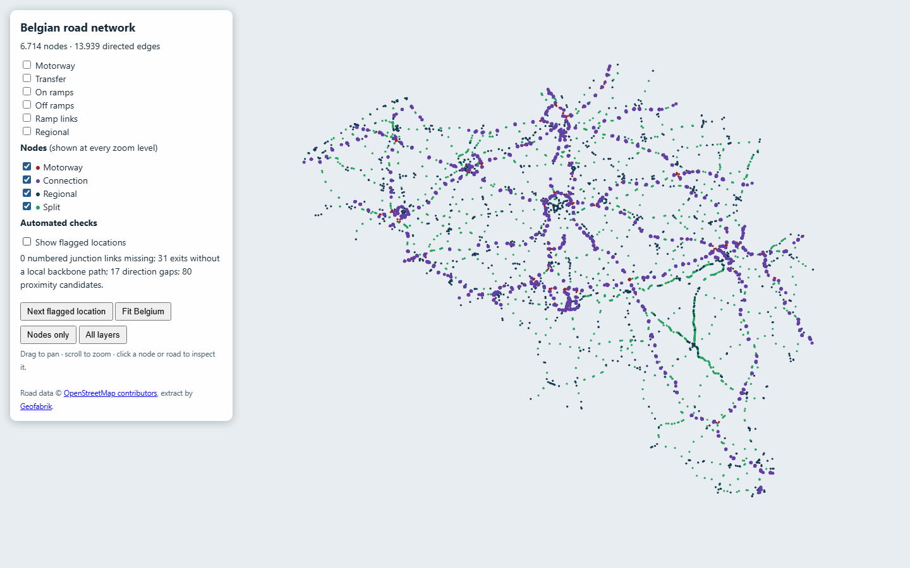
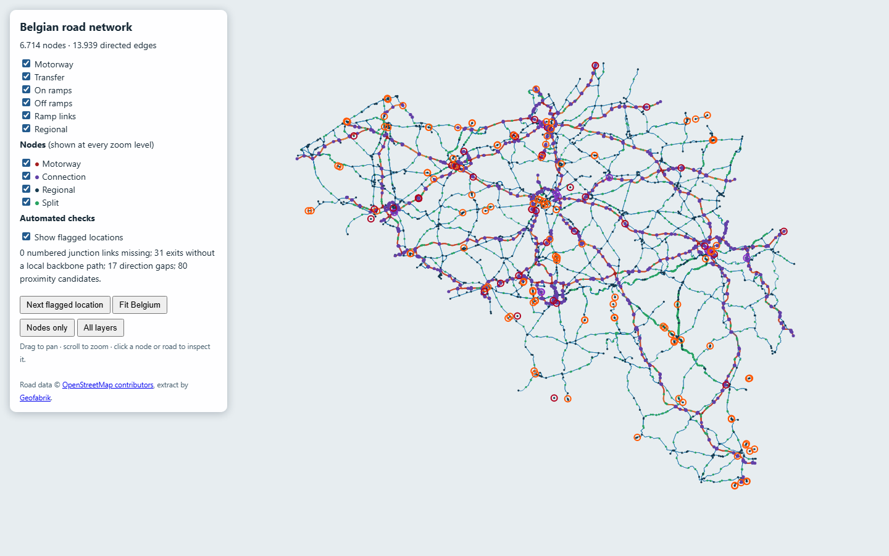

<div align="center">

# 🚗 TravelSmart Belgium

### *When is the best moment to leave?*
**A national road network measured around the clock, so any trip in Belgium gets a "when to leave" heatmap.**

[](https://github.com/kvandebeek/travelsmart/actions/workflows/publish.yml)


### [📐 Read the network design →](docs/network-design.md)

</div>

---

## 💡 The idea

Every commuter knows the feeling: leave ten minutes later and you lose half an hour on the ring road. Maps can tell you how long a trip takes **right now**, but they can't tell you **when you should have left**.

TravelSmart builds that answer from repeated measurements. Belgium's motorways and main regional roads become a network of short stretches, each measured again and again by Google Maps, TomTom and HERE. Every stretch gets a profile for every half hour of every weekday. Stitched together, they give any trip A → B an answer like this (an illustration, not a measurement):

> 🕖 *"Diepenbeek → Brussels: Tuesday to Thursday, leaving at 06:30 or after 09:30 is fastest; 07:30 is the worst half hour of the week."*

## 🚧 Status

The project is being rebuilt around that network. **[docs/network-design.md](docs/network-design.md)** describes the full design: node and edge types, endpoints (business parks, schools, hospitals, government buildings, stations, neighbourhoods), how each provider measures, storage, profiles, routing and the pages. The first commute prototype (fixed town pairs and corridors) and its data were removed on 8 October 2026.

What works today:

- **Phase 1 network builder**: reads a local Geofabrik Belgium OpenStreetMap extract and builds a directed road graph with a browser review map, plus an automated topology audit.
- **Phase 2 endpoints**: `scripts/build_endpoints.py` turns the OpenStreetMap extract and the SNCB feed into 14,137 places (stations, schools, hospitals, government, park-and-ride, business parks, airports, retail) grouped into 4,098 clusters, each hanging off the network through access edges along real roads.
- **Phase 3 collectors**: `scripts/build_chains.py` cuts the network into provider-sized chains, `scripts/measure_chains.py` measures them with TomTom or HERE, `scripts/measure_edges_google.py` measures single edges in a browser, and `scripts/run_measure_scheduler.py` runs the lot around the clock inside each provider's free tier. Every measurement is checked against the edge it was asked for before it is stored.
- **Phase 4 profiles and routing**: `scripts/build_profiles.py` turns the raw legs into a 7 x 48 profile per edge, and `scripts/plan_trip.py` answers "when should I leave?" with a week-shaped heatmap.
- **Google Maps browser collector**: `scripts/collect_google_maps.py` reads every route option Google lists (time, distance, road and traffic note) in a headless browser. It is the engine the edge collector builds on.
- **Capture import**: `scripts/import_google_maps_captures.py` merges local captures into one observation file with each route's road numbers and alternatives.
- **Open-data feeds and the OSRM baseline** (below).

Measuring needs provider keys in a local `.env` (`TOMTOM_API_KEY`, `TOMTOM_API_KEY2`, `HERE_api_key`); it is never committed. `scripts/measure_status.py` reports what has been gathered and what is left of each budget.

## 🚀 Run it yourself

Requires Python 3.10 or newer.

```bash
python -m venv .venv
.venv/bin/pip install -e ".[dev,google-maps-capture]"   # Windows: .venv\Scripts\pip install ...
.venv/bin/python -m playwright install chromium
pytest
```

Collect Google Maps travel times for a few routes (headless; add `--no-headless` to watch the browser):

```bash
python scripts/collect_google_maps.py --origin "Hasselt, Belgium" --destination "Brussels, Belgium" --once
python scripts/import_google_maps_captures.py
```

The collector opens a fresh browser tab for every route: with some browser profiles Chromium otherwise keeps one page process per visit alive until the machine runs out of memory. When Google shows its consent screen, it clicks **Reject all**; if that fails, the capture is stored as `consent_required`.

Build and inspect the road network (the 696 MB extract and generated JSON stay in `data/`, outside Git):

```bash
python -m pip install -e ".[network]"
python scripts/build_network.py --download   # later runs can omit --download
python -m http.server 8000
```

Open `http://localhost:8000/docs/network-review.html`. The map shows all graph nodes at every zoom level, with filters for motorway, connection, regional and split nodes. Click a node or road to inspect it.

Every build also writes `data/network/audit.json`. Its automatic checks flag missing links at OSM
junctions, local roads still needed to connect exits, disconnected components, isolated nodes, and
road ends that stop near another road. The review map circles those candidates and can jump between
them. Nearby lines may be bridges or parallel carriageways, so the audit does not join roads based
only on distance. The map precomputes road paths and skips geometry outside the viewport, keeping
panning and zooming responsive. The graph is still in review: the current audit found no missing
links at numbered OSM junctions and no unrepresented OSM junctions. It found 31 public-road exit connections
without a selected local path to the numbered backbone, 17 direction gaps, and 80 proximity
candidates. The checks are automatic; the map helps inspect individual flags when needed.





<details>
<summary><b>🗺️ Also included: an OSRM baseline and Flemish live feeds</b></summary>

A **baseline travel-time index** for 56 Belgian towns using an OpenStreetMap OSRM router, plus collectors for Flemish **loop detectors (MIV)** and **DATEX II road events**, which run locally or on a Raspberry Pi. In the new design they add context, for example road events that explain a jam on a stretch.

```bash
python -m travelsmart collect && python -m travelsmart export   # OSRM baseline
docker compose up -d                                            # MIV + DATEX pollers
uvicorn travelsmart.main:app --reload                           # API at /docs
```

OSRM has no live traffic. It is close to reality on rural roads but optimistic in city centres, so treat it as a baseline, not a commute time.

</details>

## 🙏 Data and attribution

| Source | Used for | Terms |
| --- | --- | --- |
| [Google Maps](https://www.google.com/maps) (browser) | Travel times and route alternatives per stretch | [Google Maps terms](https://www.google.com/help/terms_maps/) |
| [TomTom Routing API](https://developer.tomtom.com/routing-api/documentation) | Travel times per stretch (planned) | Free tier |
| [HERE Routing v8](https://www.here.com/docs/bundle/routing-api-developer-guide-v8/page/README.html) | Calibration sample (planned) | Free tier |
| [Statbel](https://statbel.fgov.be/en/open-data) | Municipalities, population per statistical sector | Open data licence |
| [Vlaams Verkeerscentrum DATEX II](https://www.verkeerscentrum.be/) | Road events | CC BY. © Agentschap Wegen en Verkeer – Vlaams Verkeerscentrum |
| [MIV open data](https://miv-opendata.belfla.be/) | Loop-detector speeds | Open data |
| [OpenStreetMap](https://www.openstreetmap.org/copyright) via Geofabrik, OSRM and Nominatim | Road network, junctions, baseline | ODbL |

<div align="center">
<br/>
<sub>🇧🇪 Built for Belgian commuters who would rather spend 20 extra minutes at home than in a traffic jam on the E40.</sub>
</div>
