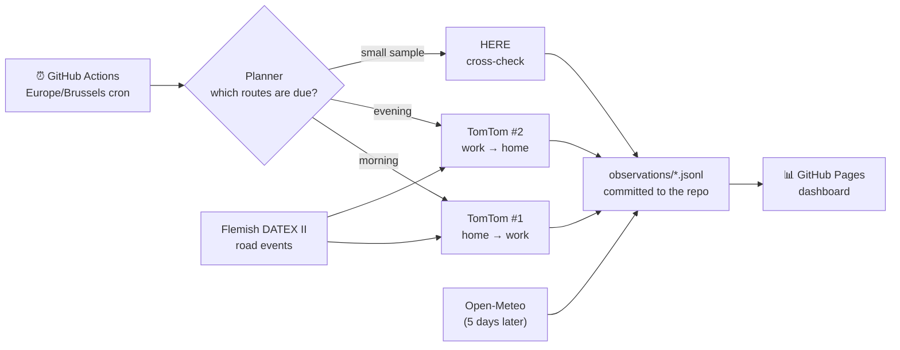

<div align="center">

# 🚗 TravelSmart Belgium

### When should you leave? Real commutes, measured every working day.

[](https://github.com/kvandebeek/travelsmart/actions/workflows/commutes.yml)


**[📊 Commute dashboard](https://kvandebeek.github.io/travelsmart/commutes.html)** · **[🗺️ Baseline dashboard](https://kvandebeek.github.io/travelsmart/)** · **[📚 Catalogue notes](docs/commute-catalogue.md)**

</div>

---

TravelSmart measures how long typical Belgian car commutes actually take: from a **residential neighbourhood to an employment area in the morning**, and back again in the evening. It records a time slot every 15–30 minutes on every working day. Over a few months, that builds up enough data to answer questions like:

> *“If I leave Diepenbeek at 07:10 instead of 07:40, how much time do I save, and does rain or the school holidays change that?”*

It does not just show a minute count. It shows each **best moment to leave**, with each observation tied to the weather, school calendar, daylight and nearby road events at the time.

## ✨ What's inside

| | |
|---|---|
| 🏘️ **446 candidate commutes** | 37 areas, each with a real residential neighbourhood (*Kessel-Lo, Sint-Amandsberg, Rooierheide…*) and an employment area (*Corda Campus, The Loop, European Quarter…*). |
| 📏 **Sensible routes only** | Trips under **12 km** of road distance are excluded. Very long trips, such as Maaseik → Oostende, go on a watchlist and may later be split at a shared motorway point. |
| 🗓️ **Budget-aware planner** | A deterministic monthly plan skips weekends and Belgian public holidays, measures 20 priority routes in every slot, and rotates the rest so each is seen in every slot each month. |
| 🔑 **Multi-account aware** | Two TomTom accounts (morning and evening) and one HERE account, each with its own budget and reserve. Every observation records which account produced it. |
| 🌦️ **Weather join** | Hourly Open-Meteo reanalysis at the origin when leaving and the destination on arrival. |
| 🏫 **School calendars** | Flemish and French Community school days, both kept, because Brussels traffic feels both. |
| 🌗 **Daylight** | Daylight, twilight or dark at departure and arrival, from a solar-position calculation. |
| 🚧 **Road events** | Live Flemish DATEX II jams, accidents, roadworks and lane closures within 500 m of the actual route geometry. |
| 📊 **Static dashboard** | Plain HTML, CSS and JavaScript on GitHub Pages, with filters for rain, school, daylight, weekday, account and road events. |

## 🧭 How it works



1. **Schedule.** The workflow fires on weekday slots from 05:00 to 09:00 and from 14:00 to 18:00, Brussels time, including during daylight-saving changes.
2. **Plan.** `commute_planner` works out which commutes belong to this slot. The plan is reproducible, so the same month always produces the same plan.
3. **Measure.** Each due route is requested *right now*, with live traffic, and stamped with the **actual request time**. A late GitHub run is stored at its real time; a missed slot stays missing. Nothing is backfilled or faked.
4. **Enrich.** Five days later, once the archive has caught up, the daily job adds historical weather at both ends of each journey.
5. **Publish.** Observations are committed as monthly JSONL files and the dashboard is rebuilt.

### 💰 The October 2026 budget

| | Morning (TomTom #1) | Evening (TomTom #2) |
|---|---:|---:|
| Slots per working day | 15 | 9 |
| Working days | 22 | 22 |
| Planned calls | 17,490 | 10,494 |
| Free monthly allowance | 20,000 | 20,000 |
| Kept in reserve | 2,000 | 2,000 |

HERE is a small cross-check: 4 routes per slot, capped at **96 calls a day and 3,000 a month**. That is well below the lowest published free allowance for HERE car routing, 5,000 a month. Every attempt counts towards the cap, including failed ones.

Run `python scripts/plan_commutes.py --month 2026-10` to recompute it. No API calls are spent.

## 🚦 Project status

> [!NOTE]
> All 446 commutes have road-snapped home and work points in `config/commute_anchors.yaml`, each with a measured road distance of at least 12 km. A slot without a configured API key is skipped with a warning; it never borrows another account's key.

| Component | State |
|---|---|
| Commute catalogue and monthly planner | ✅ Live |
| Home and work points (OpenStreetMap, road-snapped) | ✅ 446 / 446 routes verified |
| TomTom morning account | ✅ Collecting |
| TomTom evening account | ⏳ Waiting for the `TOMTOM_API_KEY2` secret |
| HERE cross-check sample | ✅ Collecting, hard-capped at 96 a day and 3,000 a month |
| Weather, school, daylight and road-event context | ✅ Live |
| Commute dashboard | ✅ GitHub Pages |
| Corridor splitting for long routes | 🧪 Design only |

## 🚀 Quick start

Requires Python 3.10 or newer.

```bash
python -m venv .venv
.venv/bin/pip install -e ".[dev]"   # Windows: .venv\Scripts\pip install -e ".[dev]"
pytest

python scripts/plan_commutes.py --month 2026-10          # inspect the plan
python scripts/plan_commutes.py --day 2026-10-12         # one day's polls
python scripts/run_commute_tick.py                       # dry run: what's due now?
python scripts/export_commutes.py                        # build dashboard data
python -m http.server --directory public 8080            # open http://localhost:8080/commutes.html
```

### Running it on your own fork

1. Add the repository secrets **`TOMTOM_API_KEY`** (morning account), **`TOMTOM_API_KEY2`** (evening account) and **`HERE_API_KEY`**.
2. Enable **Settings → Pages → Source: GitHub Actions**.
3. Check `here_daily_limit` and `here_monthly_limit` in `config/commute_schedule.yaml` against your HERE plan.

Each endpoint in `config/commute_anchors.yaml` is a residential neighbourhood or an employment area. It was found in OpenStreetMap, reviewed so that, for example, no train station counts as a home, and snapped to the nearest drivable road. A route without a `validated_routes` entry is never collected.

## 🗂️ Project map

```
config/
  commute_catalogue.yaml   areas, neighbourhoods, employment areas, cut-offs
  commute_routes.csv       generated catalogue (scripts/build_commute_catalogue.py)
  commute_schedule.yaml    slots, accounts, budgets, priority routes
  commute_anchors.yaml     verified access points (the on-switch)
travelsmart/
  commute_planner.py       working days, holidays, budgeted monthly plan
  commute_live.py          guarded TomTom/HERE collection → JSONL
  commute_context.py       school calendars, daylight, DATEX road events
  commute_weather.py       Open-Meteo historical join
  commute_export.py        static JSON for the dashboard
observations/              commute and weather JSONL, committed by the workflow
public/                    dashboards (no build step)
```

## 🗺️ Also included: the OSRM baseline and Flemish live feeds

The original v0.1 is still here: a **baseline travel-time index** for 56 Belgian towns (3,080 directional pairs) using an OpenStreetMap OSRM router, plus collectors for Flemish **MIV loop detectors** and **DATEX II road events**. These run locally or on a Raspberry Pi:

```bash
python -m travelsmart collect && python -m travelsmart export   # OSRM baseline
python scripts/run_scheduler.py                                 # recurring baseline collection
docker compose up -d                                            # MIV + DATEX pollers
uvicorn travelsmart.main:app --reload                           # API at /docs
```

OSRM estimates have **no live traffic**. A spot check found rural routes close to reality, but city-centre routes 27–47 % optimistic. Treat them as a baseline, not as commute times. Use a self-hosted OSRM for full collection runs; the public demo server will throttle you.

## 🙏 Data sources and attribution

| Source | Used for | Terms |
|---|---|---|
| [TomTom Routing API](https://developer.tomtom.com/routing-api/documentation) | Live commute times | Free tier, per account |
| [HERE Routing v8](https://www.here.com/docs/bundle/routing-api-developer-guide-v8/page/README.html) | Cross-check sample | Free tier |
| [Open-Meteo](https://open-meteo.com/en/docs/historical-weather-api) | Historical weather | CC BY 4.0 |
| [Vlaams Verkeerscentrum DATEX II](https://www.verkeerscentrum.be/) | Road events | CC BY. © Agentschap Wegen en Verkeer – Vlaams Verkeerscentrum |
| [MIV open data](https://miv-opendata.belfla.be/) | Loop-detector speeds | Open data |
| [OpenStreetMap](https://www.openstreetmap.org/copyright) via OSRM and Nominatim | Baseline routes, commute endpoints | ODbL |

Raw provider responses are not stored. Only derived travel time, distance and delay figures are kept, with the time of each request.

<div align="center">
<sub>Built for Belgian commuters who would rather spend 20 minutes at home than in a traffic jam on the E40.</sub>
</div>
