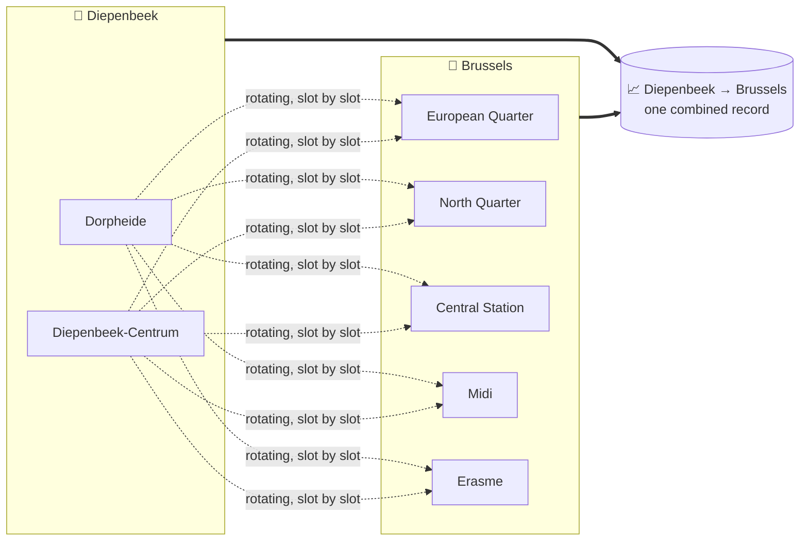
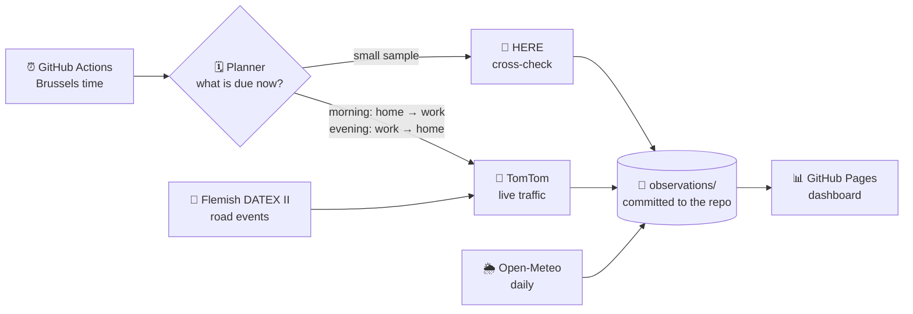

<div align="center">

# 🚗 TravelSmart Belgium

### *When is the best moment to leave?*
**Real commutes across Belgium, measured live every working day, joined with weather, school holidays, daylight and roadworks.**

[](https://github.com/kvandebeek/travelsmart/actions/workflows/commutes.yml)


### [📊 Open the live dashboard →](https://kvandebeek.github.io/travelsmart/commutes.html)

</div>

---

## 💡 The idea

Every commuter knows the feeling: leave ten minutes later and you lose half an hour on the ring road. Maps can tell you how long a trip takes **right now**, but they can't tell you **when you should have left**.

TravelSmart builds that answer from the ground up. Every working morning and afternoon it measures real Belgian commutes with live traffic. Over weeks and months, that turns into a picture of each commute:

> 🕖 *"From Diepenbeek to Brussels, leaving at 06:55 instead of 07:25 is usually faster, and the gap widens on rainy school days."*

No guesswork, no averages scraped from someone else's app. Every number comes from a measurement with a timestamp.

## 🏘️ A commute is a town, not a street

A single street corner would only tell you about that one street. So each commute record, such as **Diepenbeek → Brussels**, is fed by several real places:



- **Start places** are residential neighbourhoods, chosen from [Statbel](https://statbel.fgov.be) population data: the most populated parts of each town, spread over its former villages. Larger towns get more of them; Brussels gets one per major municipality.
- **Destinations** are real employment areas: business parks, office districts, ports and big hospitals. Larger cities have several.
- **Every combination feeds the same town record.** Each measurement rotates to a different start place and destination, so the result reflects the whole town, not one lucky street. On the dashboard you can still drill down to a single neighbourhood or employment area.

**33 Belgian towns · 90 neighbourhoods · 56 employment areas · 297 commutes**, each at least 12 km by road. Very short trips are left out.

## ✨ What every measurement carries

|                               |                                                                                                                      |
| ----------------------------- | -------------------------------------------------------------------------------------------------------------------- |
| 🚦**Live traffic**      | Travel time, distance and traffic delay, requested at the moment of departure                                        |
| 🌦️**Weather**         | Rain, temperature and wind at the start when leaving and at the destination on arrival                               |
| 🏫**School calendar**   | Flemish*and* French Community school days. Brussels traffic feels both                                             |
| 🌗**Daylight**          | Daylight, twilight or dark at departure and arrival                                                                  |
| 🚧**Road events**       | Live Flemish jams, accidents, roadworks and lane closures along the actual route                                     |
| 🕒**Honest timestamps** | Stamped with the real request time. A late run is stored as late; a missed slot stays missing. Nothing is backfilled |

## 🧭 How it runs



1. **Morning and evening peaks.** Departures from 05:00 to 09:00 (every 15–30 minutes, densest around the rush hour) and every 30 minutes from 14:30 to 17:30, on Belgian working days. Public holidays are skipped automatically.
2. **Priority commutes in every slot.** Twenty key commutes, such as Diepenbeek, Hasselt, Ghent, Antwerp and Leuven to Brussels, are measured at every departure time on every working day.
3. **Everything else in rotation.** All other commutes are spread over the month so each one builds up a full departure-time profile.
4. **A close-up of favourite commutes.** A short hand-picked list gets extra measurements every few minutes during the peaks, picked at random from the list, for a fine-grained view of the best moment to leave.
5. **Random daytime sampling.** Between the peaks, several random commutes are measured every 5 minutes, in random directions. Some head to business parks along the E313 and A12. This shows what each trip takes once the rush hour is over.
6. **Weather follows.** A daily job adds weather from the Open-Meteo archive once the hourly records are available, a few days after the trip.
7. **Always within free allowances.** Hard caps stop collection well before any provider's free tier runs out.

## 📊 The dashboard

Pick a commute and see:

- ⏱️ **Travel time by departure slot**, every measurement as a dot with the median as a line
- 🌧️ **Rain vs. dry** compared fairly, within the same commute and departure time
- 🎛️ **Filters** for start place, employment area, school days, daylight, weekday and road events
- 🧾 **An audit trail** of recent measurements: which neighbourhood, when, and under what conditions

It's plain HTML, CSS and JavaScript on GitHub Pages: no build step and no framework, and it follows your light or dark preference.

## 🚀 Run it yourself

Requires Python 3.10 or newer.

```bash
python -m venv .venv
.venv/bin/pip install -e ".[dev]"   # Windows: .venv\Scripts\pip install -e ".[dev]"
pytest

python scripts/plan_commutes.py --day 2026-10-12         # what would be measured that day
python scripts/run_commute_tick.py                       # dry run: what is due right now?
python scripts/export_commutes.py                        # build the dashboard data
python -m http.server --directory public 8080            # http://localhost:8080/commutes.html
```

**Collecting on your own fork:** add your TomTom and HERE keys as Actions secrets, using the names in `config/commute_schedule.yaml`. Then enable **Settings → Pages → Source: GitHub Actions** and check the caps in that file against your own plans.

### Local Google Maps travel times

This separate runner opens the Google Maps website in a hidden (headless) local Chromium browser; add `--no-headless` to watch it. It uses no Maps API key; its captures reach the dashboard after the import step below. When Google shows its consent screen, the runner clicks **Reject all**; travel times load the same way. If it cannot find that button, the capture is saved as `consent_required`; with `--no-headless` it instead waits up to 3 minutes for you to choose in the browser window. The runner keeps that browser profile, and the choice, in `data/google_maps_profile/`.

```powershell
.\.venv\Scripts\python.exe -m pip install -e '.[google-maps-capture]'
.\.venv\Scripts\python.exe -m playwright install chromium
.\.venv\Scripts\python.exe scripts\collect_google_maps.py --origin "Hasselt, Belgium" --origin "Leuven, Belgium" --destination "Brussels, Belgium" --interval-minutes 5
```

Repeat `--origin` for each starting point, or supply a UTF-8 file with one starting point per line using `--origins-file`. For a Belgium-wide sweep, use the 18 fixed locations in `config/google_maps_points.csv`:

```powershell
.\.venv\Scripts\python.exe scripts\collect_google_maps.py --points-file config\google_maps_points.csv --dry-run
.\.venv\Scripts\python.exe scripts\collect_google_maps.py --points-file config\google_maps_points.csv --once
```

The sweep measures every ordered pair in both directions: 18 × 17 = 306 routes. The points use stable coordinates, drawn mostly from the existing commute catalogue, across the coast, main Flemish and Walloon hubs, Brussels, the Ardennes, and the southeast. The selected routes are reshuffled each sweep, including when collecting a batch or a list of manual origins. The current 1-second default gives about 5 minutes of pauses. Page loading and a 2-second settling pause add more time. Each record has its own timestamp, so results from a sweep should not be treated as simultaneous. In particular, adding A→B and B→C travel times does not necessarily give the live A→C time because the segments are measured at different times and Google may choose different roads.

Without `--once`, the runner repeats full sweeps until Ctrl+C. It aims to start each sweep `--interval-minutes` after the previous one began; if a sweep overruns, it still pauses before starting the next. Tune pacing with `--delay-seconds`, `--jitter-seconds`, and `--settle-seconds`. These pauses cannot guarantee how Google will treat automated visits. Records go into `data/google_maps_captures/captures.jsonl` with the Brussels timestamp, sweep ID, pair position, point IDs, extracted travel time in text and minutes, route card text, and status. Add `--screenshots` only when you want labeled PNGs for review. A `route_not_detected` record means the displayed travel time could not be read automatically; rerun with `--screenshots` to inspect the page.

### Local corridor stretches

The separate stretch runner measures only adjacent points in each corridor, in both directions. `config/google_maps_stretch_corridors.yaml` defines ten chains that intersect across Belgium, including Liège → Tongeren → Bilzen → Diepenbeek → Hasselt → Leuven → Brussels → Ghent → Oostende. It reuses the fixed points above and adds intermediate places from `config/google_maps_stretch_points.csv`.

```powershell
.\.venv\Scripts\python.exe scripts\collect_google_maps_stretches.py --dry-run
.\.venv\Scripts\python.exe scripts\collect_google_maps_stretches.py --once
# Smaller trial: one corridor in one direction
.\.venv\Scripts\python.exe scripts\collect_google_maps_stretches.py --corridor liege_oostende --direction forward --once
```

The full set has 138 directed leg checks and at least 2 minutes of 1-second pauses, plus page loading and settling time. All selected legs are shuffled each sweep, including legs within a corridor. Results go to `data/google_maps_stretches/captures.jsonl`; each row includes its corridor, direction, original leg index, shared endpoint IDs, time, duration, and distance. `summaries.jsonl` has one row per corridor and direction, including the sum of leg times and the span between its first and last measurement. Incomplete corridors have no sum. Some extra points use place names rather than coordinate pins, so check their resolved locations before treating sums as precise road measurements. The runner uses a separate headless browser profile, so its first run clicks **Reject all** on Google's consent screen. Omit `--once` to repeat sweeps.

Different corridor selections can run in parallel: each selection and direction now gets its own capture folder and browser profile. For example, start these in separate PowerShell windows:

```powershell
.\.venv\Scripts\python.exe scripts\collect_google_maps_stretches.py --corridor liege_oostende --direction forward --once
.\.venv\Scripts\python.exe scripts\collect_google_maps_stretches.py --corridor wallonia_e42 --direction reverse --once
```

Use `--run-id second` when running the same selection twice at once; it gives the second run separate folders. `--dry-run` prints the chosen folders. The importer finds every resulting `captures.jsonl` under `data/`. A full unfiltered run keeps the original `data/google_maps_stretches` folders.

Adding adjacent leg times estimates a **journey through those exact listed points**. The measured legs are taken minutes apart, while a driver would enter each later leg at a later time, and Google's fastest full route may bypass some points. Keep those limits in mind when using sums as a corridor estimate.

On the dashboard, the **When is it calm?** map has an **Along a corridor** view instead of summed times. Pick a corridor and direction: each stretch, in driving order, is coloured on the map and in a strip by how it compares with **its own usual time** at the chosen departure time. A stretch's usual time is the median of its half-hour medians, so hours that happen to be measured more often do not dominate; it needs measurements in at least 4 half hours. Captures between the same two locations from any collector count. `summaries.jsonl` stays local and is not used by the dashboard; corridor sums can always be rebuilt from the imported legs (`corridor_run_id`, `leg_index`).

### Belgian municipality list and directional pairs

`config/belgian_municipalities.csv` contains all 565 Belgian municipalities from [Statbel&#39;s REFNIS register](https://statbel.fgov.be/en/open-data/code-refnis-0), with their official NIS codes and French and Dutch names. `scripts/build_belgian_municipalities.py` refreshes the list from the published CSV. These are municipalities, not every village or neighborhood. Their `location` values are place-name queries; unlike the 18 strategic points, they are not verified road pins.

```powershell
.\.venv\Scripts\python.exe scripts\plan_belgian_city_pairs.py --dry-run
.\.venv\Scripts\python.exe scripts\plan_belgian_city_pairs.py
```

The pair planner writes `data/belgian_city_pairs.csv`: 318,660 rows, one for every A→B and B→A combination. It makes no map requests. The browser runner can read the municipality file directly and process a small batch drawn from across all municipality pairs, for example:

```powershell
.\.venv\Scripts\python.exe scripts\collect_google_maps.py --points-file config\belgian_municipalities.csv --batch-start 0 --batch-size 20 --once
```

The default `--batch-order random` uses seed 42 to spread each batch across the whole pair list, then reshuffles that batch's collection order on every sweep. Use the same seed and nonoverlapping `--batch-start` ranges for parallel batches; their routes will not overlap. `global_pair_index` still identifies each route's position in the original pair list. Change the assignment with `--batch-seed`, or use `--batch-order sequential` to recover the previous contiguous batches. Keep the municipality CSV unchanged while working through a set of batches.

Each random batch gets its own browser profile and output folder, such as `data/google_maps_belgian_municipalities_batch_0_20_random_42_profile/` and `data/google_maps_belgian_municipalities_batch_0_20_random_42_captures/`. This separates new random batches from any earlier sequential batch results. Different batches can run alongside the 18-point sweep. The first run of each new profile clicks **Reject all** on Google's consent screen. Starting the **same** batch twice still shares its profile; use a distinct `--profile-dir` for that case.

A full direct sweep would need about 3.7 days of 1-second pauses alone, plus settling and page loading, so the pair plan is primarily an inventory for staged work or offline route estimation. Google's [Maps terms](https://www.google.com/help/terms_maps/) restrict mass downloading and bulk feeds; a delay does not grant permission for bulk collection.

### Import Google Maps captures into the dashboard

After the local browser collectors finish, consolidate every `data/**/captures.jsonl` into `observations/google_maps/captures.jsonl`:

```powershell
.\.venv\Scripts\python.exe scripts\import_google_maps_captures.py
.\.venv\Scripts\python.exe scripts\export_commutes.py
```

The importer converts each capture to the same observation fields used by TomTom and HERE (`provider`, `route_id`, `observed_at`, `duration_seconds`, `distance_m`, and status), keeps Google route names and source details, and skips captures already imported. Failed route reads remain as error observations. It does not invent a free-flow time or traffic delay from Google's page. The dashboard export merges these records into the monthly results, route list, recent feed, and charts. Google routes keep their actual endpoints rather than being treated as identical to a nearby TomTom or HERE commute. The combined observation file is tracked by Git; local `data/` files are not.

The **When is it calm?** map also uses Google captures, grouped per 2025 municipality. A municipality that contains a commute town (or, for Brussels, any of its 19 municipalities) joins that town's entry; other municipalities appear as their own places. Because Google shows no free-flow time, each Google route's empty-road time is its own 5th-percentile travel time, used once the route has at least 10 successful captures. Captures from quiet times of day make that reference reliable; with only busy-hour captures it is too slow and the map looks calmer than it is. Municipality points and the municipality of each Google location come from `scripts/build_municipality_points.py`; rerun it after adding new Google Maps points.

When all browser collectors have stopped and the combined file is verified, remove the old capture folders while importing any final captures:

```powershell
.\.venv\Scripts\python.exe scripts\import_google_maps_captures.py --delete-sources
```

This removes capture folders and optional screenshots, while keeping browser profile folders. Repeat the import after later collection rounds; existing observations are preserved.
If one collector is still running, add `--keep-folder data\google_maps_captures` to remove the other finished capture folders while leaving that folder untouched. Run the import again after it finishes.

**Changing the places:**

```bash
python scripts/select_home_places.py --statbel-dir <statbel>   # neighbourhoods from population data
python scripts/build_municipality_points.py --statbel-dir <statbel>  # municipality points for Google captures on the map
python scripts/build_commute_catalogue.py                      # snap to roads, pair, measure road distance
```

<details>
<summary><b>🗂️ Project map</b></summary>

```
config/
  commute_catalogue.yaml   towns, employment areas, pairing rules
  commute_homes.yaml       neighbourhoods per town (generated from Statbel)
  belgian_municipality_points.csv       main point per municipality + its commute town (Statbel)
  google_maps_place_municipalities.csv  municipality of each Google Maps location
  commute_anchors.yaml     road-snapped points + road distance per route
  commute_routes.csv       every start place → employment area route
  commute_schedule.yaml    departure slots, caps, priority commutes
travelsmart/
  commute_planner.py       working days, holidays, rotating monthly plan
  commute_live.py          guarded live collection → JSONL
  commute_context.py       school calendars, daylight, road events
  commute_weather.py       Open-Meteo join
  commute_export.py        static JSON for the dashboard
scripts/                   catalogue builders, planner, collector, exports
observations/              measurements, committed by the workflow
public/                    dashboards
```

</details>

<details>
<summary><b>🗺️ Also included: an OSRM baseline and Flemish live feeds</b></summary>

The original v0.1 remains: a **baseline travel-time index** for 56 Belgian towns using an OpenStreetMap OSRM router, plus collectors for Flemish **loop detectors (MIV)** and **DATEX II road events**, which run locally or on a Raspberry Pi.

```bash
python -m travelsmart collect && python -m travelsmart export   # OSRM baseline
docker compose up -d                                            # MIV + DATEX pollers
uvicorn travelsmart.main:app --reload                           # API at /docs
```

OSRM has no live traffic. It is close to reality on rural roads but optimistic in city centres, so treat it as a baseline, not a commute time.

</details>

## 🙏 Data and attribution

| Source                                                                                             | Used for                                            | Terms                                                           |
| -------------------------------------------------------------------------------------------------- | --------------------------------------------------- | --------------------------------------------------------------- |
| [TomTom Routing API](https://developer.tomtom.com/routing-api/documentation)                        | Live commute times                                  | Free tier                                                       |
| [HERE Routing v8](https://www.here.com/docs/bundle/routing-api-developer-guide-v8/page/README.html) | Cross-check sample                                  | Free tier                                                       |
| [Statbel](https://statbel.fgov.be/en/open-data)                                                     | Population per statistical sector → neighbourhoods | Open data licence                                               |
| [Open-Meteo](https://open-meteo.com/en/docs/historical-weather-api)                                 | Weather                                             | CC BY 4.0                                                       |
| [Vlaams Verkeerscentrum DATEX II](https://www.verkeerscentrum.be/)                                  | Road events                                         | CC BY. © Agentschap Wegen en Verkeer – Vlaams Verkeerscentrum |
| [MIV open data](https://miv-opendata.belfla.be/)                                                    | Loop-detector speeds                                | Open data                                                       |
| [OpenStreetMap](https://www.openstreetmap.org/copyright) via OSRM and Nominatim                     | Road snapping, road distances, baseline             | ODbL                                                            |

Raw provider responses are never stored. Only travel time, distance and delay are kept, together with the moment each was measured.

<div align="center">
<br/>
<sub>🇧🇪 Built for Belgian commuters who would rather spend 20 extra minutes at home than in a traffic jam on the E40.</sub>
</div>
